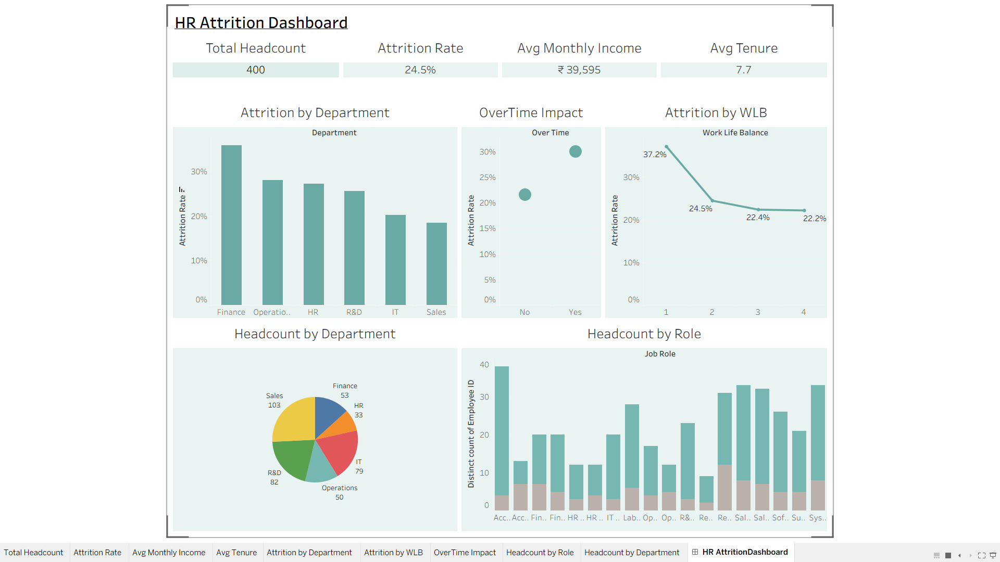

# HR Attrition & Workforce Analytics — Tableau Dashboard

An HR analytics dashboard built in Tableau using a synthetic employee dataset of 400 employees. The dashboard focuses on employee attrition, department-level trends, work-life balance, overtime impact, income, tenure, and job-role headcount.

## Dashboard Preview



## Key Dashboard Metrics

| KPI | Value |
|---|---:|
| Total Headcount | 400 |
| Attrition Rate | 24.5% |
| Average Monthly Income | ₹39,595 |
| Average Tenure | 7.7 years |

## Key Insights

- **Finance** has the highest attrition rate at **35.8%**, while **Sales** has the lowest at **18.4%**.
- Employees with the lowest **Work-Life Balance** rating (1) have an attrition rate of **37.2%**, compared with **22.2%** for employees with the highest rating (4).
- Employees working **OverTime** have a higher attrition rate (**30.0%**) than employees who do not (**21.5%**).
- Employees who leave have lower average monthly income (**₹36,641**) than employees who stay (**₹40,554**).
- Employees who leave also have shorter average tenure (**6.4 years**) compared with employees who stay (**8.1 years**).

## Dashboard Components

The final Tableau dashboard includes:

1. **KPI Summary** — Total Headcount, Attrition Rate, Average Monthly Income, and Average Tenure.
2. **Attrition by Department** — Compares attrition rates across Finance, Operations, HR, R&D, IT, and Sales.
3. **OverTime Impact** — Shows the difference in attrition between employees working overtime and those who do not.
4. **Attrition by Work-Life Balance** — Shows how attrition changes across Work-Life Balance ratings 1–4.
5. **Headcount by Department** — Displays the distribution of employees across departments.
6. **Headcount by Job Role** — Shows employee headcount across job roles, with attrition status represented in the chart.

## Dataset

The project uses `hr_employee_data.csv`, containing one row per employee and 26 variables covering:

- Employee information
- Department and job role
- Demographics
- Business travel and distance from home
- Hire date and tenure
- Monthly income and compensation
- Work-life balance and satisfaction
- Overtime
- Performance and training
- Attrition status

**Attrition** is the key outcome variable, recorded as `Yes` or `No`.

## Tools Used

- **Tableau** — Data visualization and dashboard development
- **CSV / Excel-compatible data** — Dataset source

## Files in This Repository

```text
HR-Attrition-Tableau-Dashboard/
│
├── HR_Attrition_Tableau_Dashboard.twbx
├── hr_employee_data.csv
├── dashboard.png
└── README.md
```

## Tableau Public

**Tableau Public Dashboard:** Add your Tableau Public link here after publishing the workbook.

## Project Objective

The objective of this project is to analyze employee attrition patterns and identify workforce factors that may be associated with employee turnover. The dashboard provides an interactive view of attrition across departments, work-life balance, overtime, income, tenure, and job roles.

## Project Pitch

> I built an HR attrition dashboard in Tableau using employee data to analyze department-wise attrition, the impact of work-life balance and overtime, and differences in income and tenure between employees who stayed and left. The dashboard highlights actionable patterns that can help HR teams identify areas where employee retention may need attention.
